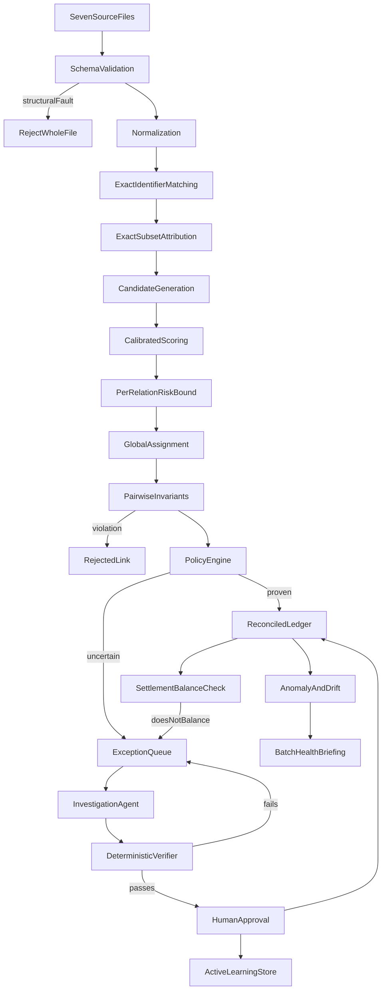
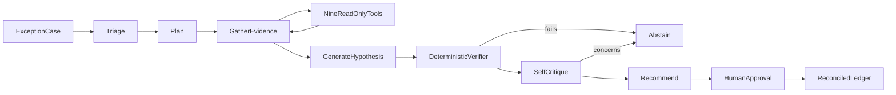

# Architecture

## The problem in one paragraph

A merchant's finance team holds seven views of the same money: an order ledger, a
payments export, a refunds export, a settlement report, a fee report, a webhook
log and a bank statement. They disagree. References go missing or get truncated
by the bank, settlements aggregate hundreds of payments without saying which,
refunds are netted against a later window than the sale, webhooks arrive twice,
timestamps lose their time component, and occasionally a rupees column is read as
paise. Closing the books means deciding which records correspond — and being able
to defend each decision afterwards.

## Pipeline

The ordering is the design. Each stage handles only what the previous one could
not prove, and the last word belongs to deterministic checks rather than to
statistical confidence.

### 1. Validation

Two failure tiers, because "fail closed" and "reject everything over one bad
cell" are different things:

- **Structural** — unreadable header, missing required column, or a row error
  rate above 5%. The whole file is rejected inside a transaction and nothing is
  written. A changed export format is a structural fault; importing half of it
  would silently understate the ledger.
- **Isolated** — one unparseable row. Rejected, recorded with its reason, and the
  rest proceeds. The row appears in the file's validation errors so its amount
  stays attributable rather than vanishing.

### 2. Normalization

Every row becomes a canonical entity with an integer paise amount, a normalized
reference and a normalized description. Original values are preserved on the
record; nothing is edited in place. Where a value had to be assumed — a
timezone-naive timestamp read as UTC, a day-first date, a date with no time — the
assumption is recorded on the record so downstream checks can respect it.

### 3. Exact matching

Where two records carry the same identifier, the link is proof rather than
evidence. This resolves the large majority of a batch.

One case is worth noting: neither the payments file nor the settlements file
states which payments settled in which batch. The **fee report does** — it is the
only source carrying both a payment id and a settlement id in the same row — so it
serves as a deterministic bridge for a relationship no single file expresses.

### 4. Exact subset attribution

A settlement reports the *total* refunds it absorbed, never which refunds those
were. Scoring refund/settlement pairs independently was measured at **18%
precision**: a refund's amount and date are equally consistent with any batch
that has room for it.

The aggregate, however, is exact. So the question becomes "which subset sums to
exactly this total", which is a branch-and-bound search with three genuinely
different answers:

| Outcome | Meaning | Handling |
|---|---|---|
| one subset | determined, not estimated | accepted as composite-exact |
| several subsets | proven ambiguity | routed to a human with the options named |
| no subset | a record is missing or an amount is wrong | left unexplained and itemised |

Reporting which of the three occurred is more useful than a confidence score over
an under-determined problem.

### 5. Candidate generation

Only for what remains. Optimizes for recall — a true link that never becomes a
candidate can never be found — with precision imposed later. Blocking keys keep
this near-linear: bank credits must equal a settlement's net exactly, so amount
is a blocking key rather than a scored feature.

### 6. Scoring and the risk bound

Twenty-two interpretable features, including two about the *situation* rather
than the pair: how many records compete for the link, and whether a truncated
reference appears inside the other side's narration.

Thresholds are chosen per relation using a one-sided Wilson lower bound on
precision. See [the model card](../model-card.md) for why per-relation, and why
the bound rather than the raw ratio.

### 7. Global assignment

Three bank credits can each look like the best match for one settlement.
Accepting all three yields a ledger that is locally plausible and globally
impossible, so one-to-one relations are solved as an assignment problem over
connected components. Many-to-one relations are bounded by value instead of
count.

### 8. Invariants

**Pairwise** checks judge one link: currency compatibility, date ordering,
allocation within the source amount, refund not exceeding capture, capacity, unit
confusion. Capacity is tracked per `(record, relation)`, not per record — a
payment being refunded and the same payment settling consume independent budgets.

**Aggregate** checks judge a settlement's complete allocation set. A set of
individually valid links can still fail to balance, and only this scope can see
it. When it fails, every accepted link in that settlement is demoted to review.

The balance assertion is exact equality with no tolerance. Both sides are
integers, and a tolerance is a place for real breaks to hide.

### 9. Exception accounting

Every rupee that was not explained appears in the queue. The guarantee, asserted
in the test suite, is that the sum of exception amounts equals the batch's
unexplained amount. A queue that understates what is at stake is the one failure
a finance team cannot detect on its own.

## Agent

Authority is bounded by the tool surface, not by the prompt. Nine read-only,
row-capped, policy-authorized tools; nothing that executes SQL, writes a record,
changes a threshold, reads the filesystem or posts a match. Denied calls are
recorded, because reaching for a forbidden tool is itself a safety signal.

The verifier is the boundary that makes a language model safe here. It looks up
every cited evidence id, confirms the candidate involves the subject, recomputes
the allocation from the records, re-runs the invariants, and enforces the policy
floor on *verified* citations only. A fabricated citation fails the
recommendation rather than persuading a reviewer.

**Why an explicit state machine rather than LangGraph.** What this workflow needs
is a persisted step log, a hard tool budget, and a verifier that can veto the
model. A framework would add orchestration over eight fixed transitions without
supplying any of the three, and every phase transition is already an
`agent_steps` row — which is the checkpointing an audit replay actually uses.

## Data model

Two invariants shape the schema:

1. **`source_records` are immutable.** Matching, agents and human resolutions all
   produce new rows referencing the original. Nothing edits an ingested value,
   which is what makes an audit replay meaningful.
2. **`audit_events` is append-only.** No code path updates or deletes a row, and
   sequence numbers are contiguous per batch so a replay can be ordered
   deterministically.

Enum columns use a type decorator that rehydrates the domain enum on read. A bare
string compares equal to a `StrEnum` member but fails an `is` check and has no
`.value`, so without it the domain logic would silently take the wrong branch —
a bug that was found and fixed during development.

## Degradation

| Missing | Consequence |
|---|---|
| Trained scorer | Deterministic matching runs; every probabilistic candidate routes to review |
| Language model | Investigations complete on rules; reconciliation unaffected |
| Earlier batch | Drift is not measured rather than measured against an invented baseline |
| Sufficient calibration data | Automation switches **off** for that relation |
| PostgreSQL | SQLite, via the same engine-portable schema |

Every degradation reduces automation. None of them reduces correctness, and none
of them is silent.
